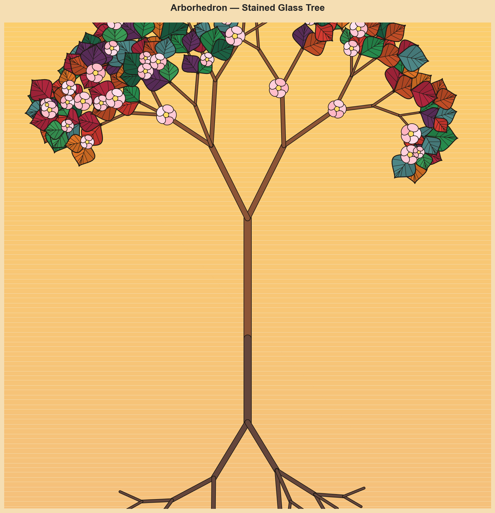
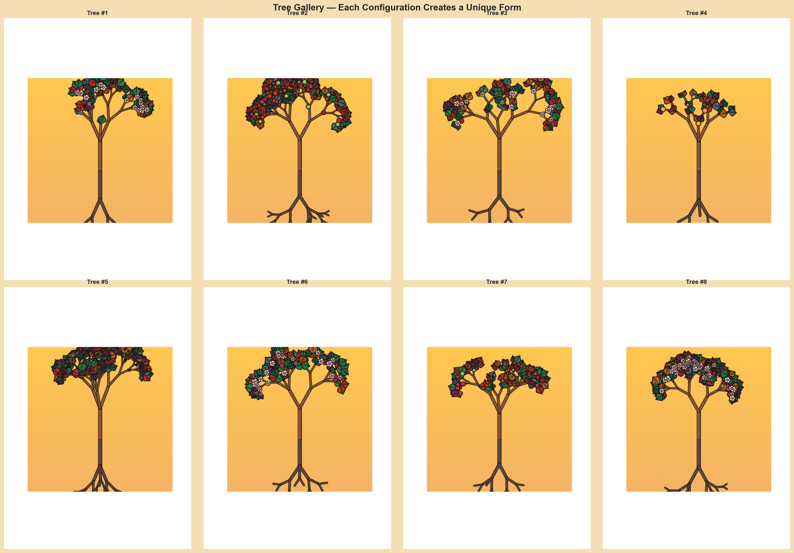

# Arborhedron

[](https://github.com/ndouglas/arborhedron/actions/workflows/ci.yml)
[](https://github.com/ndouglas/arborhedron/actions/workflows/tesseract-build.yml)

**Differentiable tree growth simulation with learned resource allocation**

A submission for the [Tesseract Hackathon 2025](https://pasteurlabs.ai/tesseract-hackathon-2025/).



## What This Is

A differentiable simulation of tree growth over a growing season, where:

- A **tree state** (energy, water, nutrients, roots, trunk, shoots, leaves, flowers, fruit) evolves over ~100 days
- **Environmental stress** (light, moisture, wind) varies sinusoidally
- A **neural network policy** decides how to allocate resources each day
- **Fitness** is measured by seed production at season's end
- Gradients flow end-to-end, enabling policy optimization via gradient descent

The simulation is decomposed into composable **Tesseracts** that can be deployed and composed via Tesseract-JAX.

## Features

### Differentiable Growth Dynamics

Built with JAX, modeling:

- Resource economics (energy, water, nutrient flows)
- Structural constraints (transport bottlenecks, self-shading)
- Environmental response (stomatal closure, wind damage)
- Reproduction (flowering, fruiting, seed production)

### Neural Allocation Policy

An MLP that observes tree state + environment and outputs resource allocation fractions. Trainable via gradient descent on seed production.

### Tesseract Composition

Three Tesseracts that compose into a differentiable pipeline:

```
neural_policy → growth_step → seed_production
     ↑              │
     └──────────────┘ (loop N days)
```

### Visualization

L-system tree rendering with stained-glass style leaves and blossoms.



## Installation

```bash
git clone https://github.com/ndouglas/arborhedron.git
cd arborhedron
python3 -m venv .venv
source .venv/bin/activate
pip install -r requirements.txt

# Build Tesseracts (requires Docker)
./buildall.sh
```

## Usage

### Run the Tesseract pipeline

```bash
python main.py
```

### Run the simulation directly

```python
from sim import SimConfig, ClimateConfig, TreeState, run_season

config = SimConfig()
climate = ClimateConfig.mild()
initial_state = TreeState.initial()

trajectory = run_season(initial_state, climate, config)
print(f"Seeds produced: {trajectory.seeds:.2f}")
```

### Render a tree

```python
from sim import generate_tree_skeleton, render_tree, TreeParams, TreeStyle

params = TreeParams(depth=4)
skeleton = generate_tree_skeleton(params, seed=42)
fig = render_tree(skeleton, TreeStyle())
fig.savefig("tree.png")
```

## Project Structure

```
arborhedron/
├── sim/                    # Core simulation
│   ├── config.py           # State and config definitions
│   ├── dynamics.py         # Growth step logic
│   ├── surrogates.py       # Biological response functions
│   ├── policies.py         # Allocation policies
│   ├── rollout.py          # Season simulation
│   └── stained_glass.py    # Tree visualization
├── tesseracts/             # Tesseract definitions
│   ├── growth_step/        # Single-day dynamics
│   ├── neural_policy/      # Allocation policy
│   └── seed_production/    # Fitness computation
├── notebooks/              # Exploration notebooks
├── tests/                  # Test suite
└── main.py                 # Tesseract composition demo
```

## Resources

- [Tesseract Core](https://docs.pasteurlabs.ai/projects/tesseract-core/latest/)
- [Tesseract-JAX](https://github.com/pasteurlabs/tesseract-jax)

## License

Apache License 2.0
